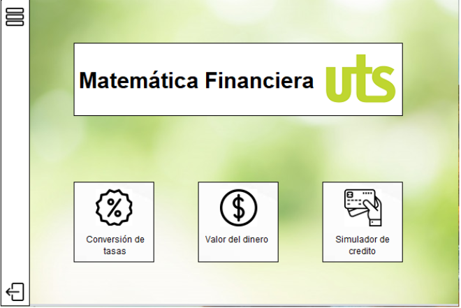
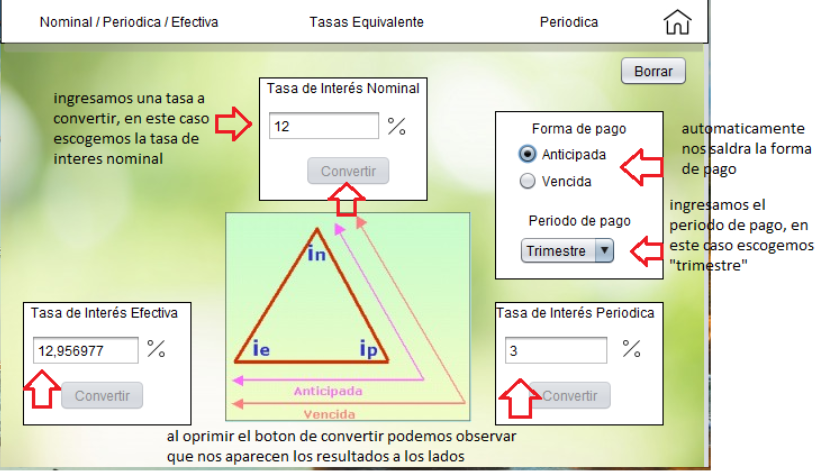
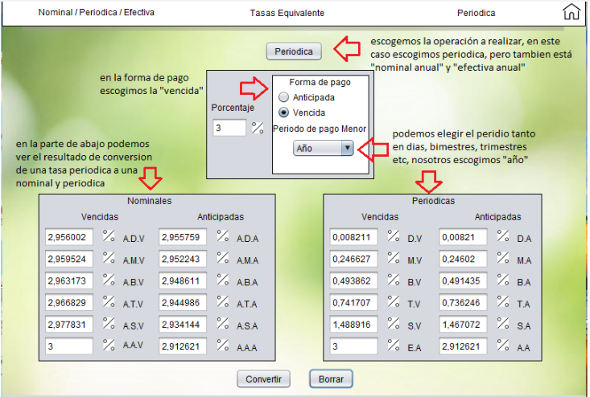
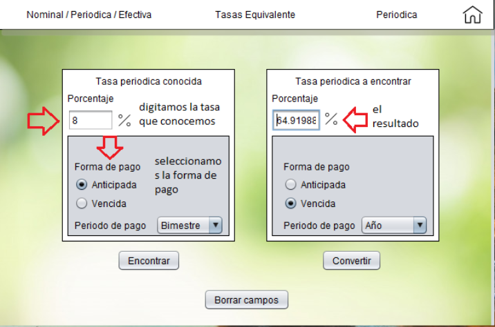
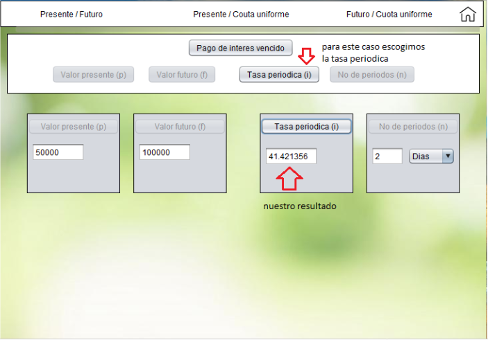
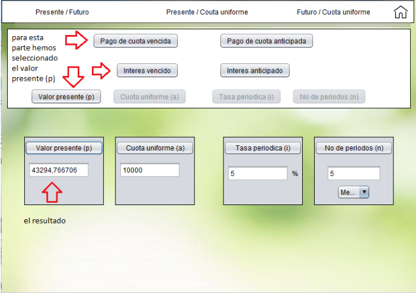
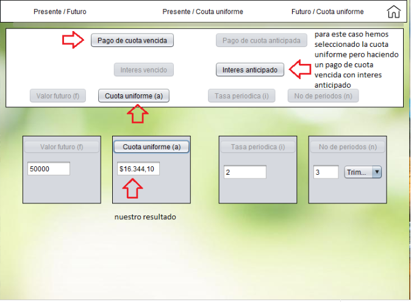
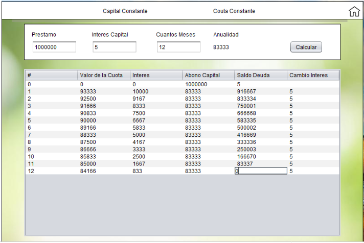
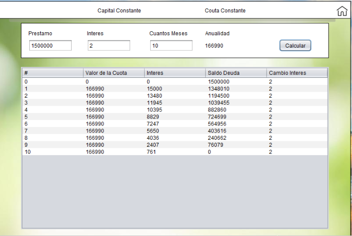

# Proyecto de Matemática Financiera

## 1. Introducción

El proyecto de matemática financiera nos ayudará, con la ayuda de ejercicios prácticos, a resolver problemas comunes que se encuentran en el programa de Matemática Financiera de las UTS.

Las funcionalidades principales del software son:

### Conversión de tasas
- Convertir cualquier tipo de tasas de equivalencia (nominales, periódicas o efectivas).
- Consultar las tasas de equivalencia de un porcentaje nominal, periódico o efectivo, ya sea vencido o anticipado, en periodos de:
  - Día
  - Mes
  - Bimestre
  - Trimestre
  - Semestre
  - Año
- Hallar cualquier tipo de tasa periódica, anticipada o vencida, en un periodo de pago definido.

### Valor del dinero
- Calcular el valor presente/futuro con pago de interés vencido o anticipado.
- Calcular el valor presente/cuota uniforme con pago de cuota vencida o anticipada, con interés vencido o anticipado.
- Calcular el valor futuro/cuota uniforme con pago de cuota vencida o anticipada, con interés vencido o anticipado.

### Simulador de crédito
- Hallar el valor de un préstamo con capital constante.
- Hallar el valor de un préstamo con cuota constante.

---

## 2. Conociendo la interfaz de usuario

### Menú principal
El menú principal cuenta con tres botones principales que permiten acceder a las diferentes áreas de matemática financiera.

---

## Conversión de tasas

Esta sección está compuesta por tres pantallas:

1. **Nominal / Periódica / Efectiva**
2. **Tasas equivalentes**
3. **Periódica**

### 2.1 Nominal / Periódica / Efectiva
En esta pantalla se puede convertir cualquier tasa de interés (periódica, nominal o efectiva) a una tasa con forma de pago anticipada o vencida, teniendo en cuenta el periodo de pago (días, meses, trimestre, semestre o año).

### 2.2 Tasas equivalentes
- Contiene botones para **Nominal Anual**, **Periódica** y **Efectiva**.
- Al seleccionar uno, las demás opciones se ocultan.
- Permite modificar la forma de pago (anticipada o vencida) y el periodo de pago (días, meses, bimestre, trimestre, semestre, año).

### 2.3 Periódica
- Muestra dos secciones: **tasa periódica conocida** (izquierda) y **tasa periódica a encontrar** (derecha).
- Para ejecutar las operaciones:
  1. Presionar el botón **Encontrar** para calcular la tasa periódica.
  2. Presionar el botón **Convertir** para hallar la tasa deseada.

---

## Valor del dinero

Esta sección cuenta con tres subpantallas:

1. **Presente / Futuro**
2. **Presente / Cuota uniforme**
3. **Futuro / Cuota uniforme**

### 3.1 Presente / Futuro
Permite calcular el valor presente o futuro de un monto, con pago de interés vencido o anticipado.

### 3.2 Presente / Cuota uniforme
- Tres filas de opciones:
  1. Tipo de pago: **Cuota vencida** o **Cuota anticipada**.
  2. Tipo de interés: **Interés vencido** o **Interés anticipado**.
  3. Variable a encontrar.
- En cada fila solo se puede escoger una opción.
- Al seleccionar una combinación, se abren ventanas para ingresar datos y obtener el resultado.

### 3.3 Futuro / Cuota uniforme
- Misma estructura que la pantalla de "Presente / Cuota uniforme".
- Los pasos y restricciones son iguales.
- Se abre una ventana para ingresar datos según la opción seleccionada.

---

## Simulador de crédito

Esta sección tiene dos subpantallas:

1. **Capital constante**
2. **Cuota constante**

### 4.1 Capital constante
- Interfaz amigable y fácil de usar.
- Basta con completar los campos para obtener el resultado.

### 4.2 Cuota constante
- Estructura similar a la pantalla de **Capital constante**.
- Se completan los campos requeridos para calcular el valor del préstamo.

---
